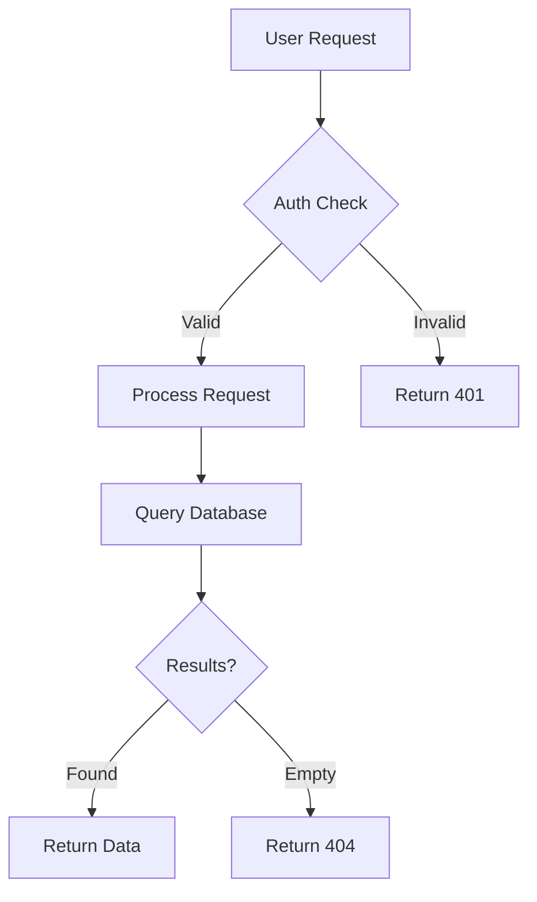
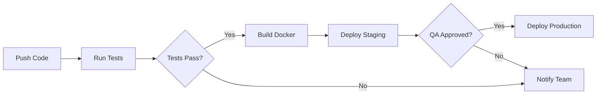
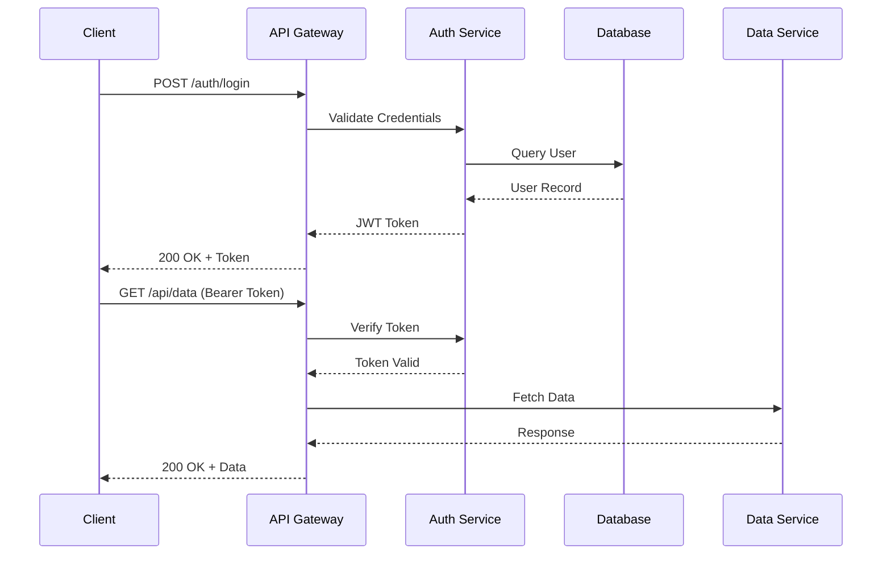
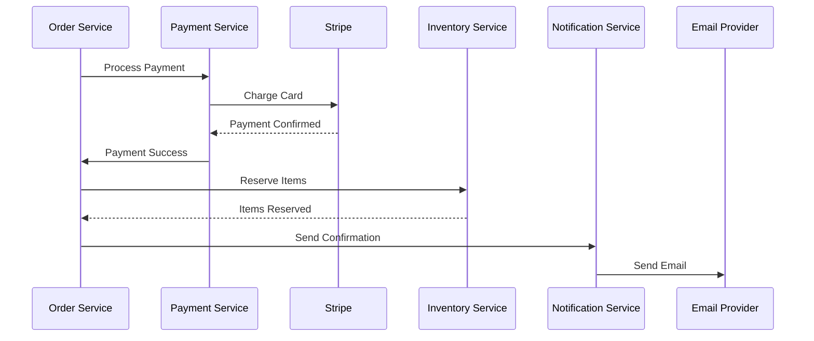
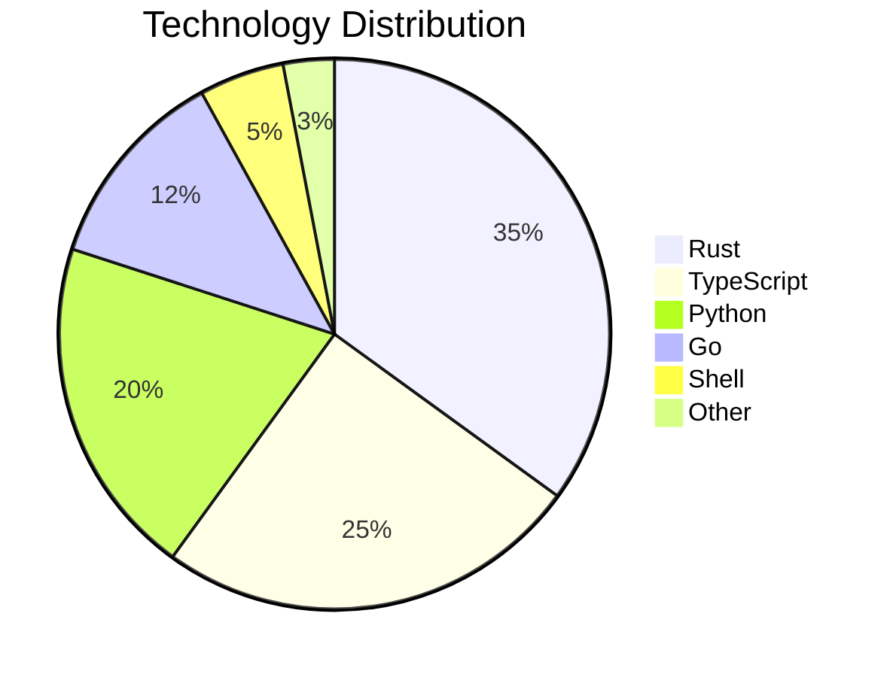
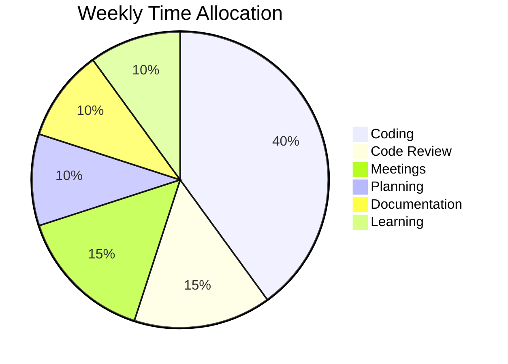
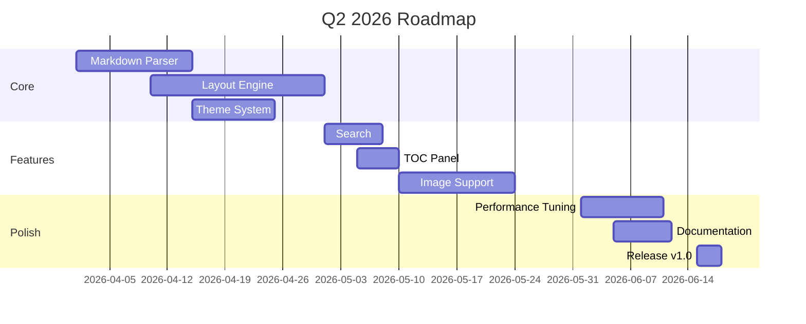

# Diagrams & Charts Demo

## Flowcharts

### Simple Flow



### CI/CD Pipeline



## Sequence Diagrams

### API Authentication Flow



### Microservice Communication



## Pie Charts

### Tech Stack Distribution



### Time Allocation



## Gantt Charts

### Product Roadmap



## Tree Structures

Here's a project directory tree:

```
ink/
├── Cargo.toml
├── src/
│   ├── main.rs
│   ├── app.rs
│   ├── config.rs
│   ├── parser/
│   │   ├── mod.rs
│   │   └── frontmatter.rs
│   ├── layout/
│   │   ├── mod.rs
│   │   ├── table.rs
│   │   └── mermaid.rs
│   ├── render/
│   │   ├── mod.rs
│   │   └── plain.rs
│   ├── theme/
│   │   ├── mod.rs
│   │   ├── builtin.rs
│   │   └── detect.rs
│   └── input/
│       └── mod.rs
├── themes/
│   ├── dark.toml
│   └── dracula.toml
└── tests/
    └── fixtures/
        ├── test.md
        └── diagrams.md
```

## Nested Data Visualization

### Decision Matrix

| Criteria        | Weight | Option A: Rust | Option B: Go | Option C: Python |
|-----------------|--------|----------------|--------------|------------------|
| Performance     | 30%    | 9/10           | 8/10         | 5/10             |
| Memory Safety   | 25%    | 10/10          | 7/10         | 6/10             |
| Developer Speed | 20%    | 6/10           | 8/10         | 9/10             |
| Ecosystem       | 15%    | 7/10           | 7/10         | 10/10            |
| Binary Size     | 10%    | 9/10           | 8/10         | 3/10             |
| **Total**       | **100%** | **8.35**     | **7.60**     | **6.55**         |

### Feature Comparison

| Feature               | ink   | glow  | bat   | rich  | mdcat | frogmouth |
|-----------------------|-------|-------|-------|-------|-------|-----------|
| Rendered Markdown     | ✓     | ✓     | ✗     | ✓     | ✓     | ✓         |
| Syntax Highlighting   | ✓     | ✓     | ✓     | ✓     | ✓     | ✓         |
| Inline Images         | ○     | ✗     | ✗     | ✗     | ✓     | ✗         |
| Clickable Links       | ✓     | ✗     | ✗     | ✗     | ✓     | ✗         |
| Table of Contents     | ✓     | ✗     | ✗     | ✗     | ✗     | ✓         |
| Theme Picker          | ✓     | ✗     | ✓     | ✗     | ✗     | ✗         |
| In-Document Search    | ✓     | ✗     | via less | ✗  | ✗     | ✗         |
| Mermaid Diagrams      | ✓     | ✗     | ✗     | ✗     | ✗     | ✗         |
| Admonitions           | ✓     | ✗     | ✗     | ✗     | ✗     | ✓         |
| Word-Wrapped Tables   | ✓     | ✗     | ✗     | ✗     | ✗     | ✗         |
| Multi-File Tabs       | ✓     | ✗     | ✗     | ✗     | ✗     | ✗         |
| Progress Bar          | ✓     | ✗     | ✗     | ✗     | ✗     | ✗         |
| Word Count / ETA      | ✓     | ✗     | ✗     | ✗     | ✗     | ✗         |
| Fast Startup (<10ms)  | ✓     | ○     | ✓     | ✗     | ✓     | ✗         |
| Single Binary         | ✓     | ✓     | ✓     | ✗     | ✓     | ✗         |

> **Legend:** ✓ = supported, ✗ = not supported, ○ = planned/partial

## Code Examples

### Rust — Error Handling

```rust
use std::fs;
use std::io;

#[derive(Debug)]
enum AppError {
    Io(io::Error),
    Parse(String),
    NotFound { path: String },
}

impl From<io::Error> for AppError {
    fn from(err: io::Error) -> Self {
        AppError::Io(err)
    }
}

fn read_config(path: &str) -> Result<String, AppError> {
    let content = fs::read_to_string(path)?;
    if content.is_empty() {
        return Err(AppError::Parse("Empty config file".into()));
    }
    Ok(content)
}
```

### TypeScript — Async Pipeline

```typescript
interface Pipeline<T> {
  pipe<U>(fn: (value: T) => Promise<U>): Pipeline<U>;
  execute(): Promise<T>;
}

async function fetchUserData(userId: string) {
  const response = await fetch(`/api/users/${userId}`);
  if (!response.ok) throw new Error(`HTTP ${response.status}`);
  return response.json();
}

const result = await createPipeline(userId)
  .pipe(fetchUserData)
  .pipe(validatePermissions)
  .pipe(enrichWithMetadata)
  .execute();
```

### Python — Data Processing

```python
from dataclasses import dataclass
from typing import Iterator

@dataclass
class Record:
    id: int
    name: str
    score: float

def process_records(records: Iterator[Record]) -> dict[str, float]:
    """Aggregate scores by first letter of name."""
    aggregated: dict[str, list[float]] = {}
    for record in records:
        key = record.name[0].upper()
        aggregated.setdefault(key, []).append(record.score)
    return {k: sum(v) / len(v) for k, v in aggregated.items()}
```

## Admonitions

> [!NOTE]
> This file demonstrates all of ink's rendering capabilities including mermaid diagrams, word-wrapped tables, syntax highlighting, and admonitions.

> [!TIP]
> Press `T` to open the theme picker and preview all 8 built-in themes in real-time.

> [!WARNING]
> Some diagram types (like gantt) use approximate visual representations since terminal rendering has inherent limitations compared to graphical output.

> [!IMPORTANT]
> All content in tables is always fully visible — ink word-wraps cells instead of truncating them.

---

*Generated for ink — the most advanced terminal markdown reader.*
