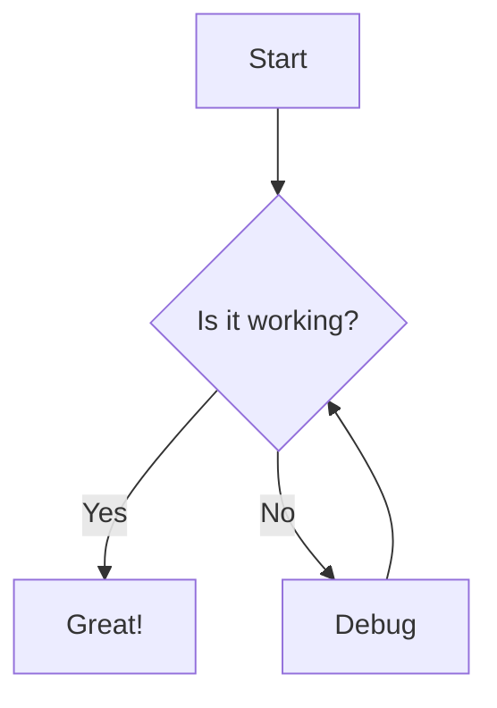
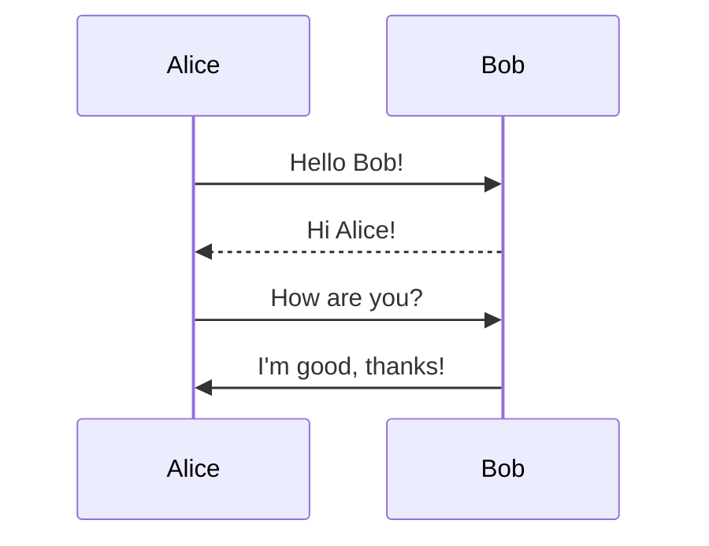
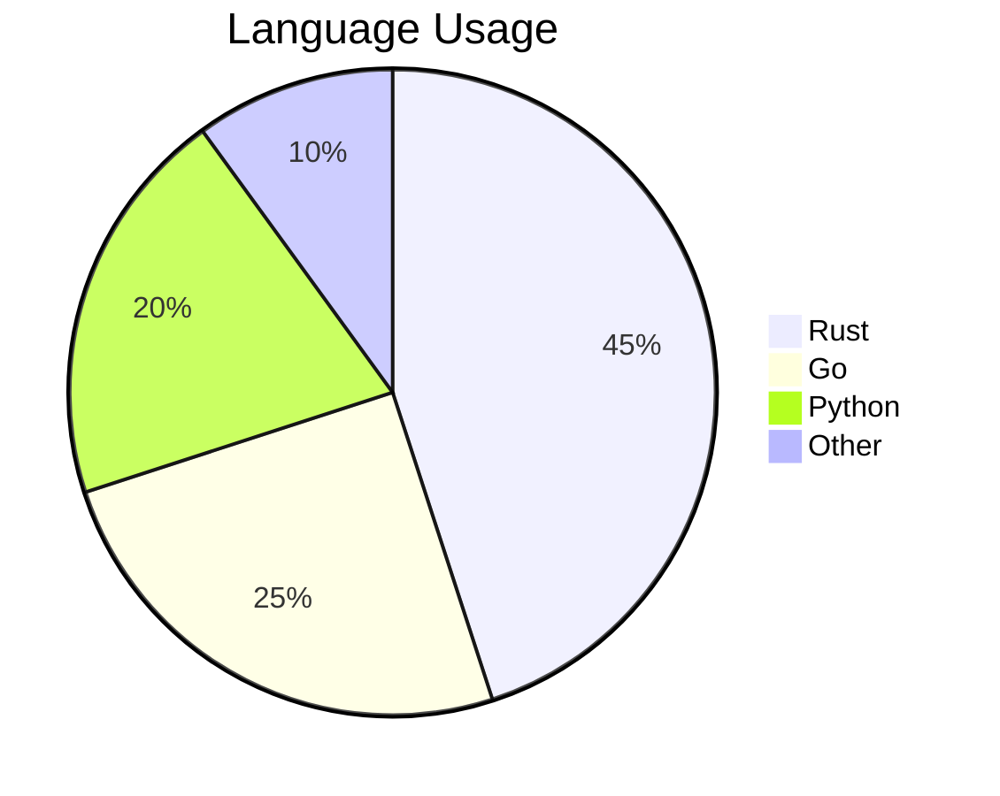

# Welcome to Ink

The most advanced terminal markdown reader, built with **Rust** and *love*.

## Features

- **Blazing fast** startup (~5ms)
- Full **GFM** rendering
- Mouse scrolling support
- Beautiful themes with true color
- ~~Legacy tools~~ are now obsolete

### Code Blocks

Here's some Rust code:

```rust
fn main() {
    println!("Hello from ink!");
    let numbers: Vec<i32> = (1..=10).collect();
    for n in &numbers {
        if n % 2 == 0 {
            println!("{n} is even");
        }
    }
}
```

And some Python:

```python
def fibonacci(n):
    a, b = 0, 1
    for _ in range(n):
        yield a
        a, b = b, a + b

for num in fibonacci(10):
    print(num)
```

## Tables

| Feature       | Glow | Bat | Rich | **Ink** |
|---------------|------|-----|------|---------|
| Rendered MD   | Yes  | No  | Yes  | **Yes** |
| Inline Images | No   | No  | No   | **Yes** |
| Clickable URLs| No   | No  | No   | **Yes** |
| Smooth Scroll | No   | No  | No   | **Yes** |
| Fast Startup  | Med  | Fast| Slow | **Fast**|

## Blockquotes

> "The best way to predict the future is to invent it."
> — Alan Kay

> **Note:** This is a nested blockquote example.
> It spans multiple lines and preserves
> the formatting beautifully.

## Task Lists

- [x] Markdown parsing (comrak)
- [x] TUI framework (ratatui)
- [x] Theme engine
- [ ] Inline image support
- [ ] Smooth scrolling
- [ ] Mermaid diagrams

## Links

Check out the [Rust Programming Language](https://www.rust-lang.org/) for more info.

Also see [Ratatui](https://ratatui.rs/) — the TUI framework powering ink.

## Horizontal Rule

---

## Nested Lists

1. First item
   - Sub-item A
   - Sub-item B
     - Deep nested
2. Second item
3. Third item
   1. Ordered sub-item
   2. Another one

## Footnotes

This is a statement with a footnote[^1].

[^1]: This is the footnote content.

---

## Mermaid Diagrams

### Flowchart



### Sequence Diagram



### Pie Chart



## Admonitions

> [!NOTE]
> This is a helpful note for the reader.

> [!WARNING]
> Be careful with this operation — it cannot be undone.

> [!TIP]
> Use `ink --toc` to show the table of contents sidebar.

> [!IMPORTANT]
> Always back up your data before proceeding.

> [!CAUTION]
> This will delete all your files permanently.

---

*Built with ink — the terminal markdown reader that does it all.*
